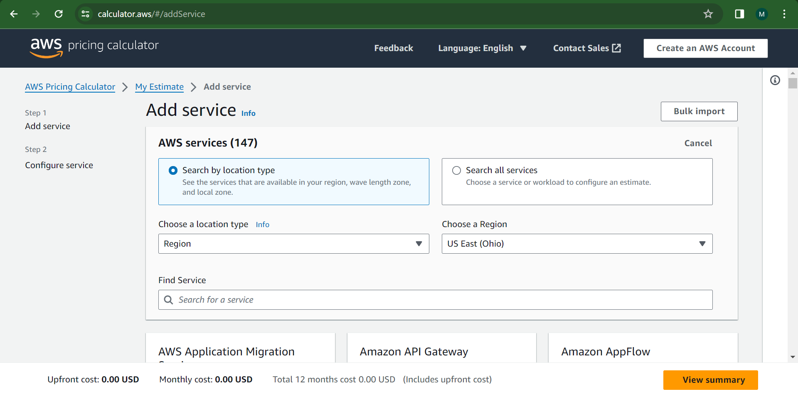
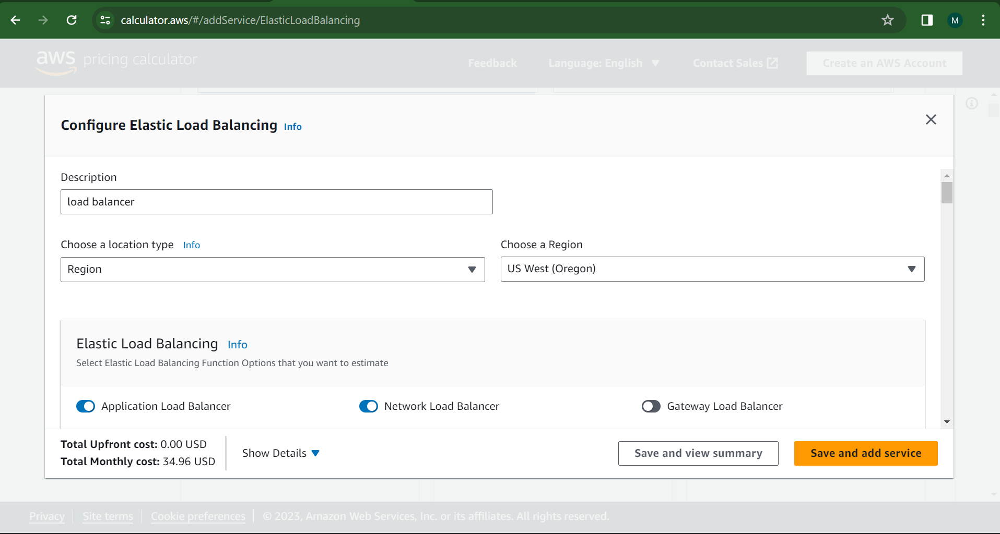
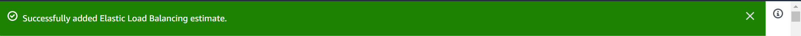
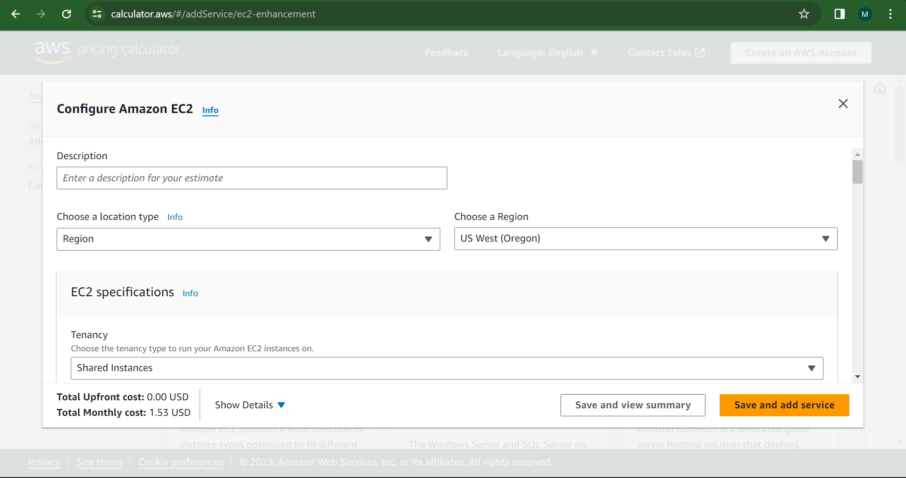
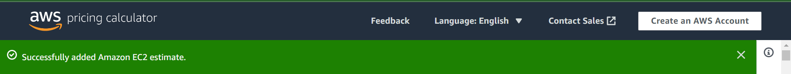
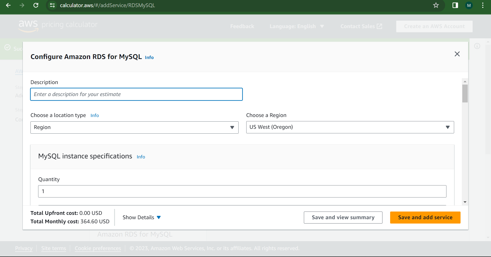
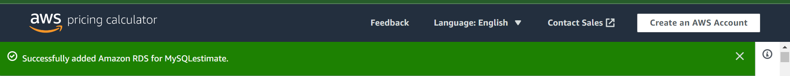
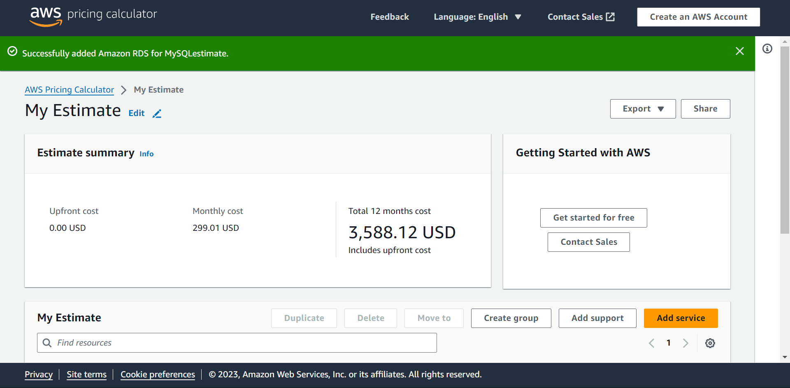
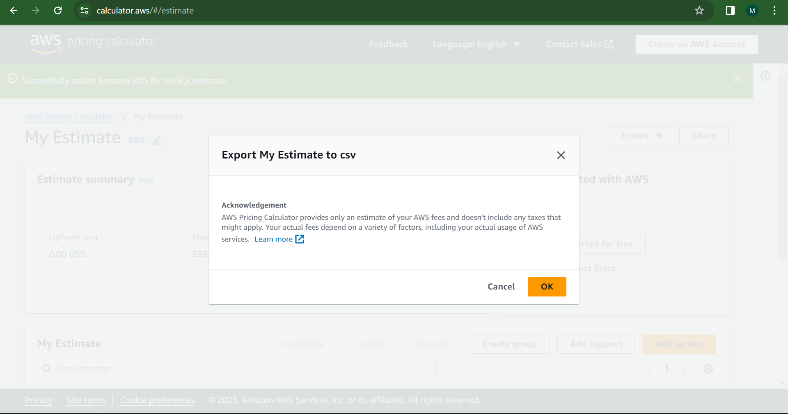

- Task 1: Launch the AWS Pricing Calculator

In this task, you launch AWS Pricing Calculator and begin to create an estimate.

Open a new web browser tab.
In the address bar enter the following URL: 
```
https://calculator.aws/#/
```
Choose Create estimate.

___
- **Task 2: Add and configure services in AWS Pricing Calculator**

In this task, you use AWS Pricing Calculator to explore AWS services and create an estimate for the cost of your use case, a three-tier web application.

1 **Add the load balancer:** to the estimate

On the Select service page, in the Find Service search box, enter 
```
Elastic Load Balancing
```
In the Elastic Load Balancing card, choose 
```
Configure
```
In the Description section, configure the following options:
For Description, enter
```
Load Balancer
```
For Select location type, choose
```
Region
```

For Select region, choose 
```
US West (Oregon)
```
For Elastic Load Balancing, turn on 
``````
Application Load Balancer
``````

In the Application Load Balancer section, choose 
``````
Load Balancer in AWS Region
``````

In the Service settings section, for Number of Application Load Balancers, enter 
``````
1
``````

In the Load Balancer Capacity Units (LCUs) section, configure the following options:

***Note: The load balancer metrics that are used to estimate cost, such as processed bytes and connection duration, are typically provided by the team that developed and tested the application. These numbers vary based on the application profile.***

Skip Processed bytes (Lambda functions as targets) because you are using EC2 instances.
For Processed bytes (EC2 Instances and IP addresses as targets), enter 
``````
0.36
``````
 From the dropdown list, choose 
 ``````
 GB per hour
``````

For Average number of new connections per ALB, enter 
``````
100
``````
 From the dropdown list, choose 
 ``````
per second
``````

For Average connection duration, enter 
``````
3
``````
From the dropdown list, choose 
``````
minutes
``````
For Average number of requests per second per ALB, enter 
``````
400
``````
For Average number of rule evaluations per request, enter 
``````
20
``````

***Note: Load balancer listener rules determine how the load balancer routes requests. For example, the default rule only routes HTTP traffic on port 80 to the EC2 instances (targets).*** 



Choose Save and add service.

### Add the EC2 instance to the estimate
On the Select service page, in the Find Service search box, enter 
``````
EC2
``````
In the Amazon EC2 card, choose 
``````
Configure
``````

In the Description section, configure the following options:
For Description, enter 
``````
EC2
``````
For Select location type, choose 
``````
Region
``````
For Select region, choose 
``````
US West (Oregon)
``````
In the EC2 instance specifications section, for Operating system, choose 
``````
Linux
``````
In the Workload section, configure the following options:
Choose 
``````
Daily spike traffic
``````
Keep the settings for Workload days 
``````
Monday - Friday
``````
For Baseline, enter 
``````
1
``````
For Peak, enter 
``````
2
``````
Note: These settings indicate that this workload requires one instance at normal times and two instances during peak usage.
For Duration of peak (hours,minutes), keep the 
``````
default settings
``````
In the EC2 instances section, choose 
``````
t4g.small
``````
In the Pricing strategy section, choose 
``````
On-Demand
``````
In the Amazon Elastic Block Storage (EBS) section, configure the following storage options:
For Storage for each EC2 instance, choose 
``````
General Purpose SSD (gp3)
``````
For General Purpose SSD (gp3) - IOPS, keep the
``````
default setting
``````
For General Purpose SSD (gp3) - Throughput, keep the 
``````
default setting
``````
For Storage amount, enter 
``````
30
``````
From the dropdown list, choose 
``````
GB
``````
In the Data transfer section, configure the following options:
- **For Inbound Data Transfer:**\
From the first dropdown list, choose 
``````
Internet (free)
``````
Enter 
``````
50
``````
From the last dropdown list choose 
``````
GB per month
``````
- **For Outbound Data Transfer:**

From the first dropdown list, choose 
``````
Internet (0.05 USD - 0.09 USD per GB)
``````
Enter 
``````
200
``````
From the last dropdown list, choose 
``````
GB per month
``````

Choose Save and add service.
___

### Add the RDS instance to the estimate

On the Select service page, in the Find Service search box, enter 
```
RDS
```
In the Amazon RDS for MySQL card, choose 
``````
Configure
``````


In the Description section, configure the following options:
For Description, enter 
``````
Database
``````
For Select location type, choose 
``````
Region
``````
For Select region, choose 
``````
US West (Oregon)
``````
In the MySQL instance specifications section, configure the following options:
For Quantity, enter 
``````
1
``````
From the dropdown list, choose 
``````
db.m6g.large
``````

For Deployment option, choose 
``````
Multi-AZ
``````
For Pricing model, keep the default setting.
Skip the RDS Proxy section.
In the Storage section, configure the following settings:

For Storage for each RDS instance, choose 
``````
General Purpose SSD (gp2)
``````
For Storage amount, enter 
``````
100
``````
 From the dropdown list, 
 ``````
 choose GB
 ``````
Skip the Backup Storage and Snapshot Export sections.\

**Choose Save and add service.**
___

### Task 3: **Review and download the estimate**
In this task, you review the cost estimate that the calculator generated, and you download a copy of the estimate into a **comma-separated values (CSV)** file. A CSV file can be opened in desktop tools such as Excel.

**- Choose View summary**\
Review the overall costs that AWS Pricing Calculator generated for the services from the My Estimate page. AWS Pricing Calculator provides the total cost for the first 12 months. If needed, you can edit or delete the configuration of the services added by choosing the edit icon  next to each service name.


The preceding screenshot is an example of the cost estimate summary.

- ***Note: The prices found in your estimate may vary as prices occasionally change.*** 

Choose Export, and then choose CSV.

In the Export My Estimate to csv dialog box, choose OK.
Use your local file explorer to save the file.
___

### **Task 4: Save and share the estimate**
In this task, you share your estimate with others and save it. 

Commonly, estimates need to be shared with others such as managers, project team members, or even customers.

Choose Share.

In the Save estimate dialog box, choose 
``````
Agree and continue.
``````
To copy the link for your estimate, choose Copy public link.

To share the estimate, send the link to others using a communication tool such as email.

Note: When you share an estimate, AWS Pricing Calculator automatically saves it and generates a URL to access it. AWS Pricing Calculator saves your estimate for 3 years. 
___

- ### **Summary**
In this lab, I created a cost estimate using AWS Pricing Calculator. I added the components that are required for a three-tier web application (application, logic and database tier) and defined the sizing requirements for each service. I previewed the annual cost estimate and generated a link to share the estimate with others. 

Now, ***"I know how to evaluate the potential costs of architectures before I deploy them"***. This helps me control my AWS costs and avoid unpleasant surprises such as unexpected or higher monthly bills.

Well done ***_KeLLs***